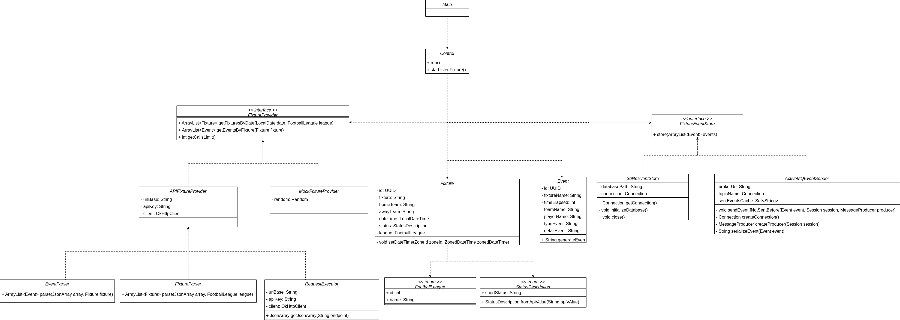
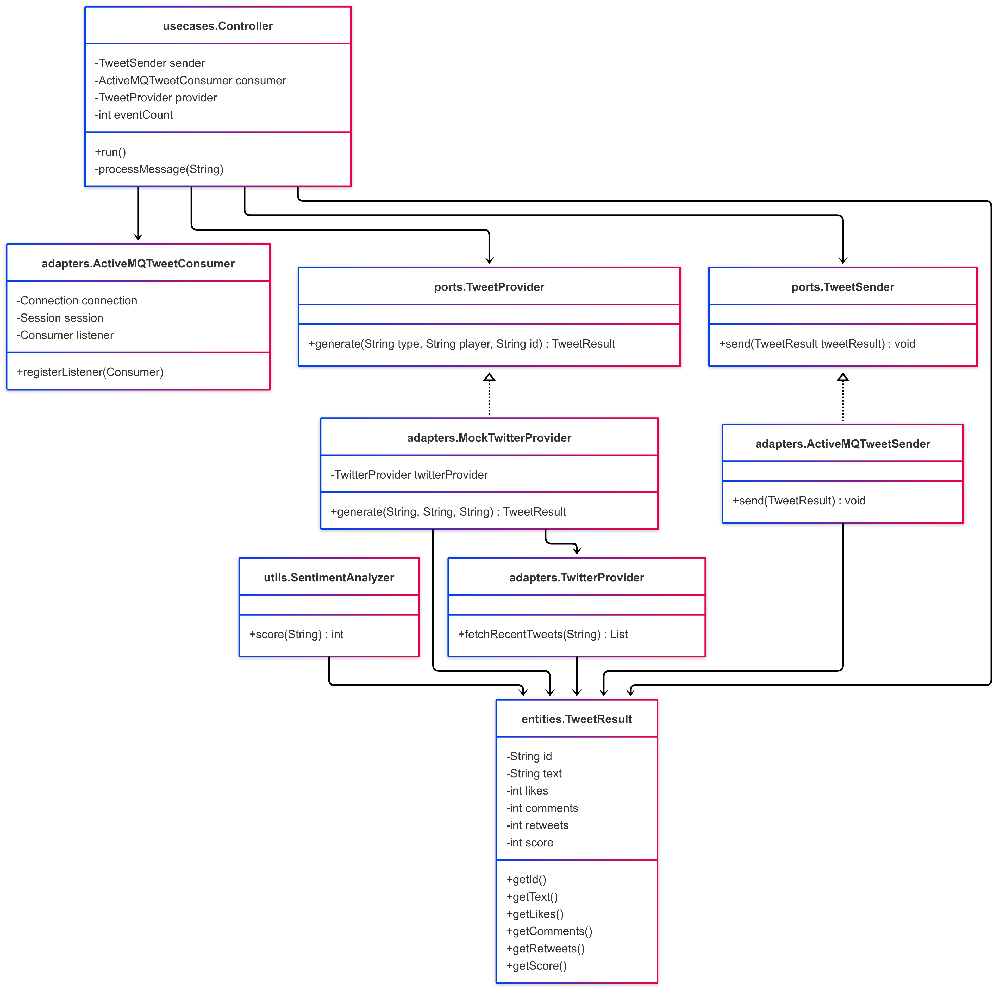
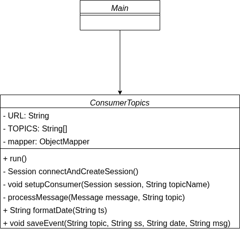
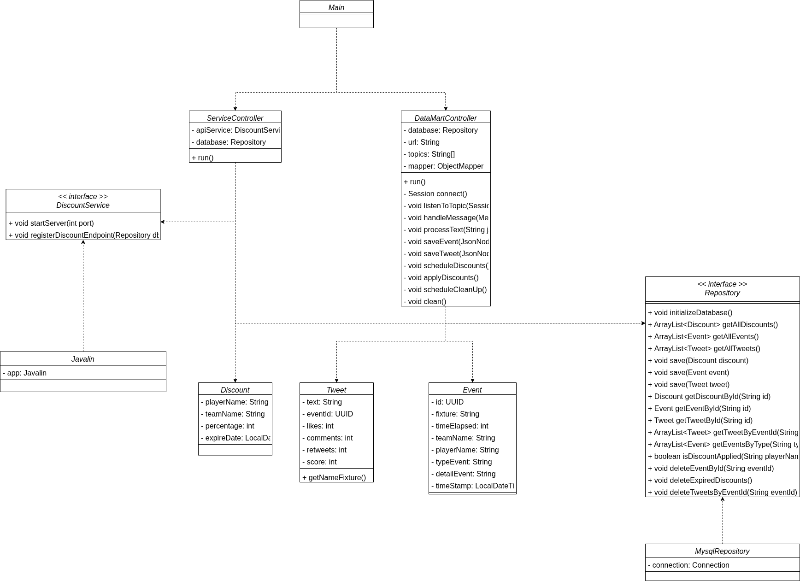
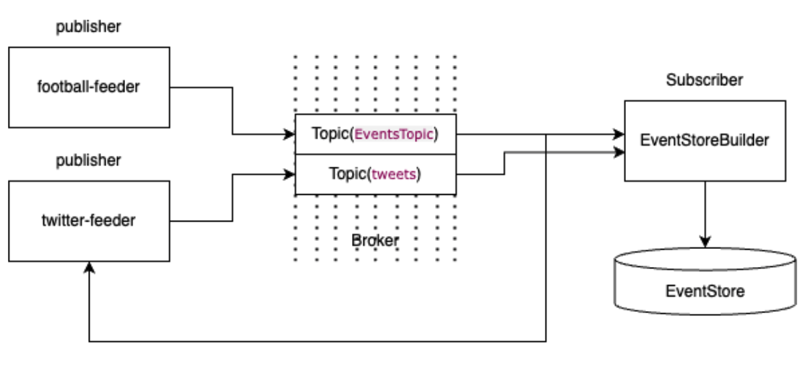

 # 🚀 LiveSportsPromo

> **Propuesta de valor**: Un sistema modular para capturar datos en tiempo real (tweets, eventos de fútbol), procesarlos con análisis de sentimiento y almacenarlos en un event-store y datamart, listo para alimentar promociones dinámicas mediante una API.

---


## 📂 Estructura del Repositorio

```

LiveSportsPromo/
|
|
├── discount-api/
|        |
│        └── src/
|              ├── main/java/
|              |         |
|              |         ├── adapters/
|              |         |      |
|              |         |      └── helpers
|              |         |
|              |         ├── entities
|              |         |
|              |         ├── ports
|              |         |
|              |         └── useCases
|              |
|              ├── resources
|              |
|              └── pom.xml
|
├── EventStoreBuilder/ 
|        |
│        └── src/
|             ├── main/java/
|             |
|             └── pom.xml
|
|
├── football-feeder/
|        |
│        └── src/
|              ├── main/java/
|              |         |
|              |         ├── adapters/
|              |         |      |
|              |         |      └── helpers
|              |         |
|              |         ├── entities
|              |         |
|              |         ├── ports
|              |         |
|              |         └── useCases
|              |
|              ├── resources
|              |
|              └── pom.xml
|
|
├── twitter-feeder/
|        |
│        └── src/
|              ├── main/java/
|              |         |
|              |         ├── adapters
|              |         |
|              |         |
|              |         ├── entities
|              |         |
|              |         ├── ports
|              |         |
|              |         ├── ports
|              |         |
|              |         └── utils
|              |
|              └── pom.xml
|
|
├── diagrams/ 
|
├── README.md                  ← Documentación del Proyecto
|
└── .gitignore

```

---

## 👥 Equipo

- **Daniel Rodríguez Alonso**
- **Pablo Martínez Suárez**

Repositorio: https://github.com/DACD-Daniel-y-Pablo/LiveSportsPromo.git

---

## 🛠️ Módulos y Ejecución

Este proyecto se compone de 4 módulos principales:

1. `football-feeder`
2. `twitter-feeder`
3. `EventStoreBuilder`
4. `discount-api`

## ⚙️ Requisitos del Entorno

Antes de ejecutar cualquiera de los módulos, asegúrate de tener:

* **Java** 11+
* **Maven** 3.6+
* **ActiveMQ** descargado y ejecutándose localmente (por defecto en `tcp://localhost:61616`).
* **MySQL** instalado y en funcionamiento en tu máquina.
* Una base de datos creada llamada **`discount_promo`**.

## 🛠️ Módulos y Ejecución

Este proyecto consta de cuatro módulos principales:

### football-feeder

```bash
java -jar football-feeder/target/football-feeder.jar \
  <FOOTBALL_API_KEY> \
  <BASE_URL_API> \
  <URL_SQLITE> \
  EventsTopic \
  tcp://localhost:61616
```

* **FOOTBALL\_API\_KEY**: Clave de la API de deportes.
* **BASE\_URL\_API**: URL base de la API de fútbol.
* **URL\_SQLITE**: Ruta al fichero SQLite local.

---

### twitter-feeder

```bash
java -jar twitter-feeder/target/twitter-feeder.jar \
  tcp://localhost:61616 \
  EventsTopic \
  tweets \
  <TWITTER_BEARER_TOKEN>
```

* **TWITTER\_BEARER\_TOKEN**: Token OAuth2 para la API de Twitter.

---

### EventStoreBuilder

```bash
java -jar EventStoreBuilder/target/EventStoreBuilder.jar \
  tcp://localhost:61616 \
  EventsTopic \
  tweets
```

---

### discount-api

```bash
java -jar discount-api/target/discount-api.jar \
  tcp://localhost:61616 \
  EventsTopic \
  tweets \
  jdbc:mysql://localhost:3306/discount_promo \
  <MYSQL_USER> \
  <MYSQL_PASSWORD>
```

* **MYSQL\_USER** / **MYSQL\_PASSWORD**: Credenciales de MySQL.

---
## ⚙️ Configuración Previa

Antes de ejecutar los módulos, asegúrate de tener los siguientes servicios configurados y activos:

### *🟢 ActiveMQ*

Debe estar corriendo en `tcp://localhost:61616` con dos topics configurados:

- `EventsTopic` → para consumir
- `tweets`      → para publicar

### *🟢 MySQL*

Debes tener instalado y en ejecución un servidor **MySQL** en tu máquina local. Además, es necesario que:

- Exista una base de datos creada llamada: `discount_promo`
- Tengas las credenciales (usuario y contraseña) preparadas para conectarte a dicha base de datos durante la ejecución de los módulos.

---

## 🏗️ Arquitectura

1. **football-feeder**: Consume API-Football y publica eventos en ActiveMQ.



2. **twitter-feeder**: Captura tweets y analiza sentimiento, publica en ActiveMQ.



3. **EventStoreBuilder**: Lee topics y guarda eventos en ficheros.



4. **discount-api**: Consume eventos y expone un endpoint REST.



### Flujo de datos



* **Business-Unit**: Consume del broker y habilita un endpoint en el que consumir los descuentos disponibles

---

### 🔗 Endpoint de ejemplo

```http
curl http://localhost:8080/discounts
```
Un ejemplo de uso sería conectarse al endpoint expuesto por el módulo `discount-api`. Desde allí, otras plataformas pueden consultar los descuentos generados por los módulos `football-feeder` y `twitter-feeder`, y aplicarlos en su sistema correspondiente.

Esto permite integrar la lógica de promociones en tiempo real dentro de una plataforma externa (por ejemplo, una tienda online o una app de servicios).

**Respuesta**:

```json
[
  {
    "playerName": "C. Stuani",
    "teamName": "Girona",
    "percentage": 15,
    "expireDate": [
      2025,
      5,
      19
    ]
  }
]
```

---

## 📚 Buenas Prácticas y Patrones

* **Arquitectura Hexagonal** (Ports & Adapters)
* **Single Responsibility Principle**
* **Event-Driven** (Pub/Sub con ActiveMQ)
* **Clean Code** y nomenclatura consistente

---

## 🗓️ Roadmap

|  Sprint | Objetivos                         |
|---------| --------------------------------- |
| 1       | Consumo de APIs (fútbol, Twitter) |
| 2       | Broker y Event Store Builder      |
| 3       | Business Unit (API REST / CLI)    |


---

© 2025 LiveSportsPromo-Daniel-y-Pablo
